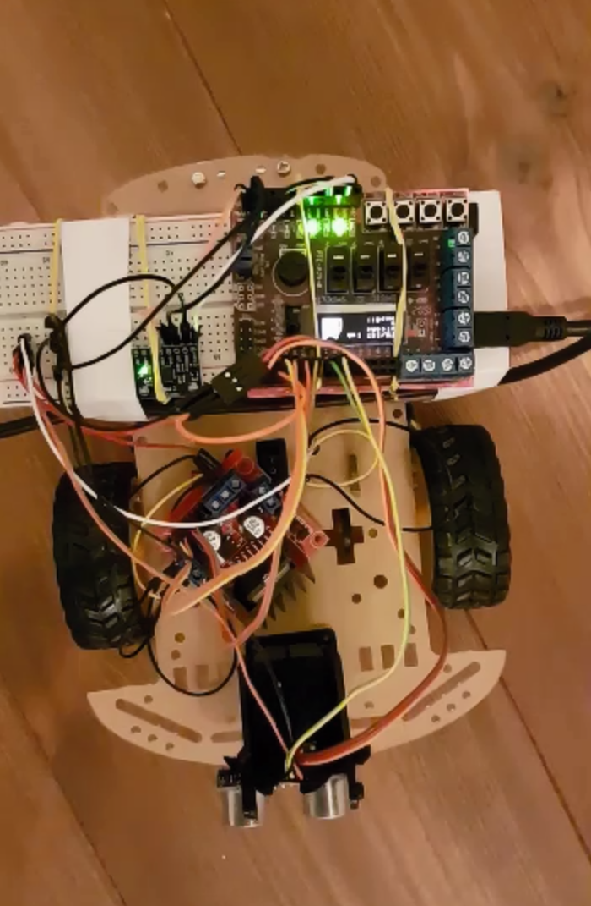

# The Car

Code to our obstacle avoiding robot made with the PIC32 microcontroller

We used the squeletton code provided by KTH and initialized all the registers, connected sensors and motors.
The vehicle behavior was trivial to implement.

Have fun with this beauty!
